# Ames-Housing-Project

In this project, will explore the Ames, Iowa Housing Dataset Here start by conducting some exploratory data analysis followed by processing the data based on the findings.
The goal is ultimately to accurately create a regression model and this will predict the sales price of houses in the test set given the data in the training set. Then I submitted my test set to kaggle for Kaggle Competitions.
Table of Contents:

- Discussion and Background
- Cleaning and Visualizing data Featuring matrix
- Model Fitting Model Evaluation Prediction that model with given testing data
- Neural Network Model
- Findings and Recommendation of the project

## Discussion and Background

### Data Cleaning Process:

1. **Loading the Dataset**: The Ames Housing Dataset was loaded successfully.
2. **Handling Missing Values**:
   - Removed columns with more than 25% missing values. This step helped in reducing the dimensionality of the dataset and focusing on relevant features. The features were:
     df1 = df_train.drop(['PID', 'MS SubClass', 'MS Zoning', 'Lot Frontage',
     'Street', 'Alley', 'Lot Shape', 'Land Contour', 'Utilities',
     'Lot Config', 'Land Slope', 'Condition 1',
     'Condition 2','Roof Style',
     'Roof Matl',
     'Exter Cond','Bsmt Qual', 'Bsmt Cond', 'Bsmt Exposure', 'BsmtFin Type 1',
     'BsmtFin SF 1', 'BsmtFin Type 2', 'BsmtFin SF 2',
     'Heating', 'Heating QC', 'Central Air', 'Electrical',
     'Low Qual Fin SF', 'Gr Liv Area',
     'Bsmt Half Bath', 'Kitchen AbvGr',
     'Fireplace Qu',
     'Garage Finish',
     'Garage Cond',
     'Enclosed Porch', '3Ssn Porch',
     'Screen Porch', 'Pool QC', 'Fence', 'Misc Feature',
     'Misc Val', 'Sale Type','Bsmt Qual','BsmtFin Type 1','BsmtFin SF 1','Garage Qual','Kitchen AbvGr','Bsmt Half Bath','Misc Val','Pool Area'],axis = 1)
   - Identified and filled missing values for various features such as lot frontage and garage type.
   - Certain methods like interpolation and using median values from the neighborhood were used to fill the gaps efficiently.
3. **Handling Outliers**:
   - Outliers in features such as 'GrLivArea' and 'TotalBsmtSF' were identified and removed to prevent them from skewing the model.
4. **Feature Engineering**:
   - Created new features that might help in improving the model's accuracy, such as total square footage of the house and an overall score combining current condition and quality.
5. **Data Transformation**:
   - Performed transformations like log transformation on skewed features to normalize their distribution.
6. **Exporting Cleaned Data**: The cleaned and preprocessed data was saved as 'cleaned_data.csv' for further analysis.

These steps ensured that the dataset was primed for more detailed exploratory data analysis, feature engineering, and model building in the subsequent phases of the project.

Next, I will review the exploratory data analysis and feature engineering notebook to extract important steps and findings.

Here's a summary of the key steps and findings from the Exploratory Data Analysis (EDA) and Feature Engineering notebook:

### Exploratory Data Analysis:

1. **Statistical Summary**:
   - Provided a descriptive statistical summary for the dataset, including mean, median, mode, standard deviation, and range for each feature.
   - 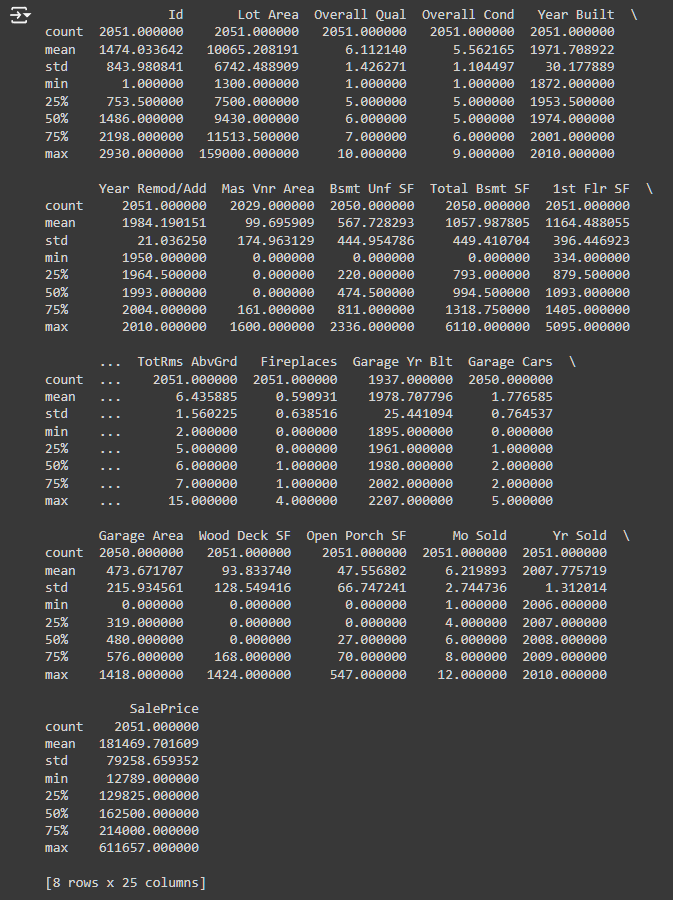
2. **Visualization of Distributions**:
   - Histograms and box plots were used extensively to visualize the distributions of key features like 'SalePrice', 'GrLivArea', and 'TotalBsmtSF'. This helped in identifying the skewness in the data.
   - 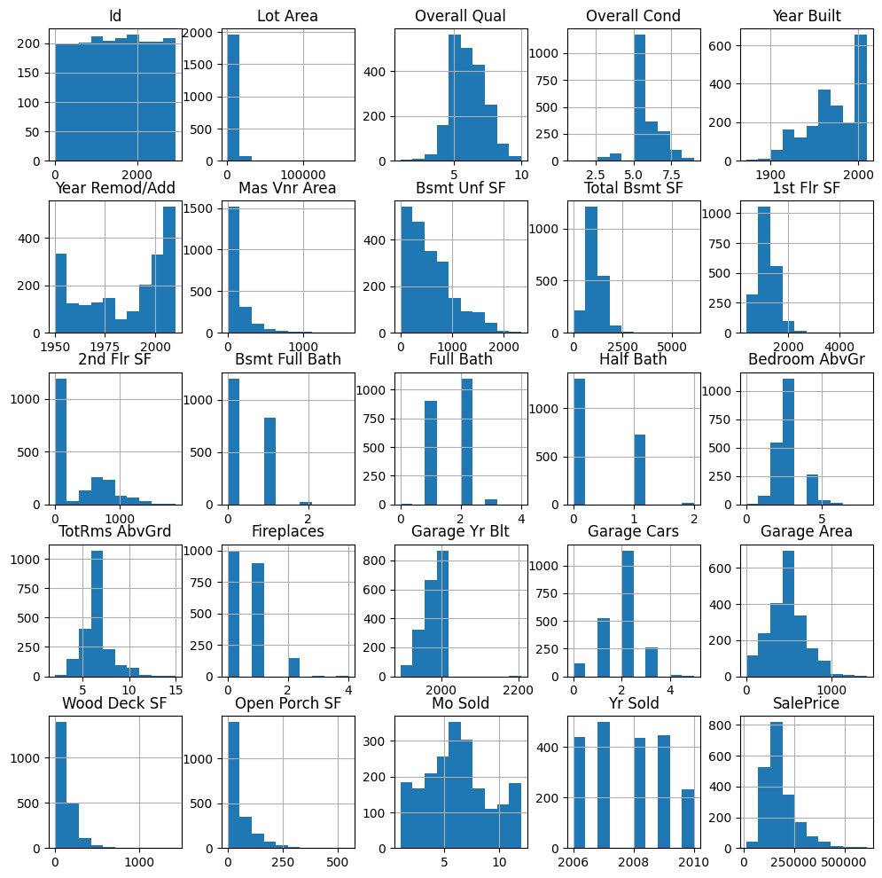
3. **Correlation Analysis**:
   - Heatmaps were created to visualize the correlations between features. Strong correlations were observed between 'SalePrice' and features such as 'OverallQual', 'GrLivArea', and 'GarageCars'.
   - 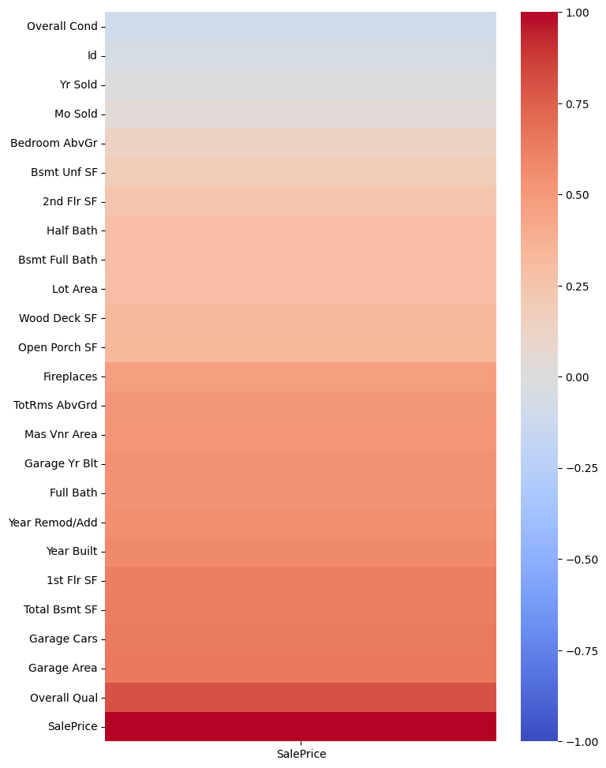
4. **neighbourhood Analysis**:
   - We tried to find Cluster of neighbourhoods and their effect on Sale Price and also with Total_sqft.
   - Neighbourhood clustering according to SalePrice. we see 4 clear clusters.
   - 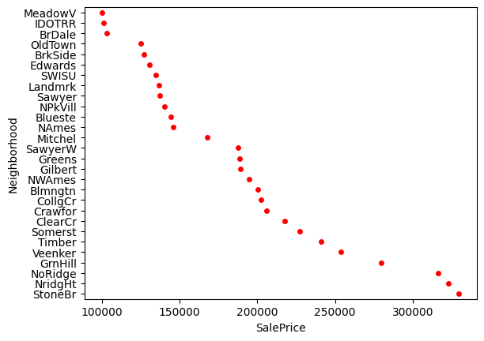
   - Neighbourhood Clustering with respect to Total_Sqft. we can see 5 to 6 clusters.
   - 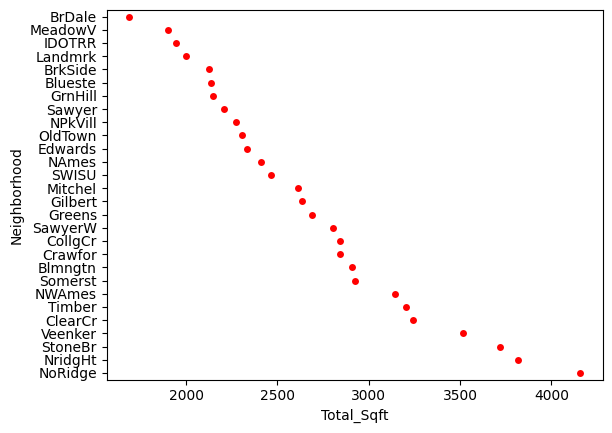

### Feature Engineering:

1. **Handling Skewness**:
   - Log transformation was applied to features with significant skewness to normalize their distributions, particularly for the target variable 'SalePrice'. The data was already quite normally distributed, so this step was not as critical as it might be in other datasets.
2. **Creation of New Features**:
   - New features were derived from existing data, such as 'TotalSF/total_sqft' (total square footage), which is a combination of basement, first floor, and second floor square footages.
   - df_train['Total_Sqft']= df_train['Total Bsmt SF']+df_train['Wood Deck SF']+df_train['Open Porch SF']+df_train['1st Flr SF']+df_train['2nd Flr SF']
3. **Outlier Detection and Removal**:
   - Outliers were further identified using scatter plots and box plots, especially for 'TotalBsmtSF' and 'GrLivArea'. Points that significantly deviated from the norm were removed to prevent model distortion.
   - 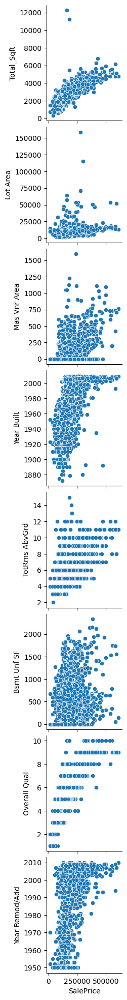
   - 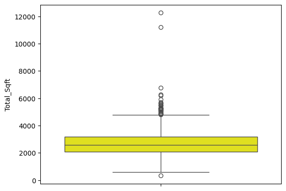
   - 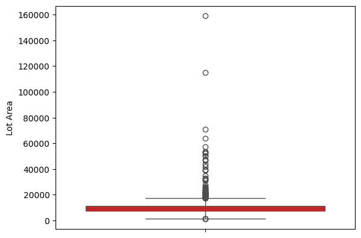
   - 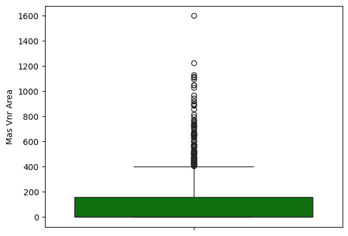
   - 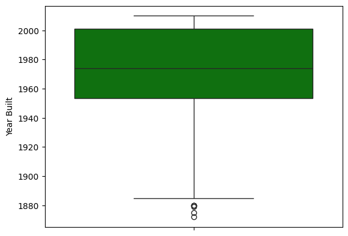
   - 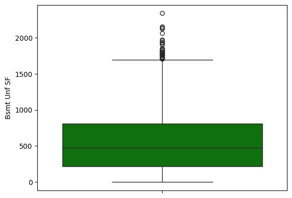
   - 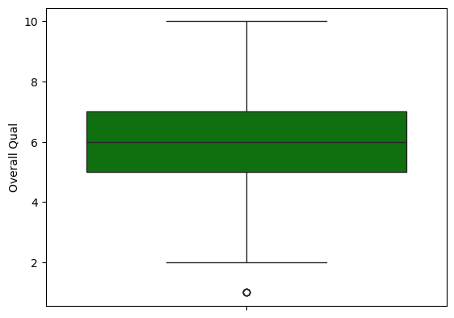
   - 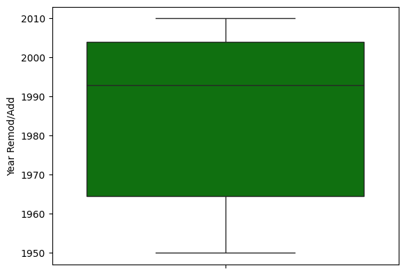

### Data Preparation for Modeling:

- The cleaned and engineered dataset was exported as 'eda_feature_engineered.csv' for use in the modeling steps.

These preprocessing steps laid a solid foundation for building robust models by enhancing the quality of the data and creating potentially informative features.

Next, I'll review the notebook on single feature linear regression to extract key steps and results.

Here's a summary of the key steps and findings from the notebook on single feature linear regression:

### Single Feature Linear Regression:

1. **Feature Selection**:

   - The model used 'Total Square Feet' as the single feature to predict the 'SalePrice'. This choice was based on previous correlation findings indicating a strong relationship between size and price.
   - 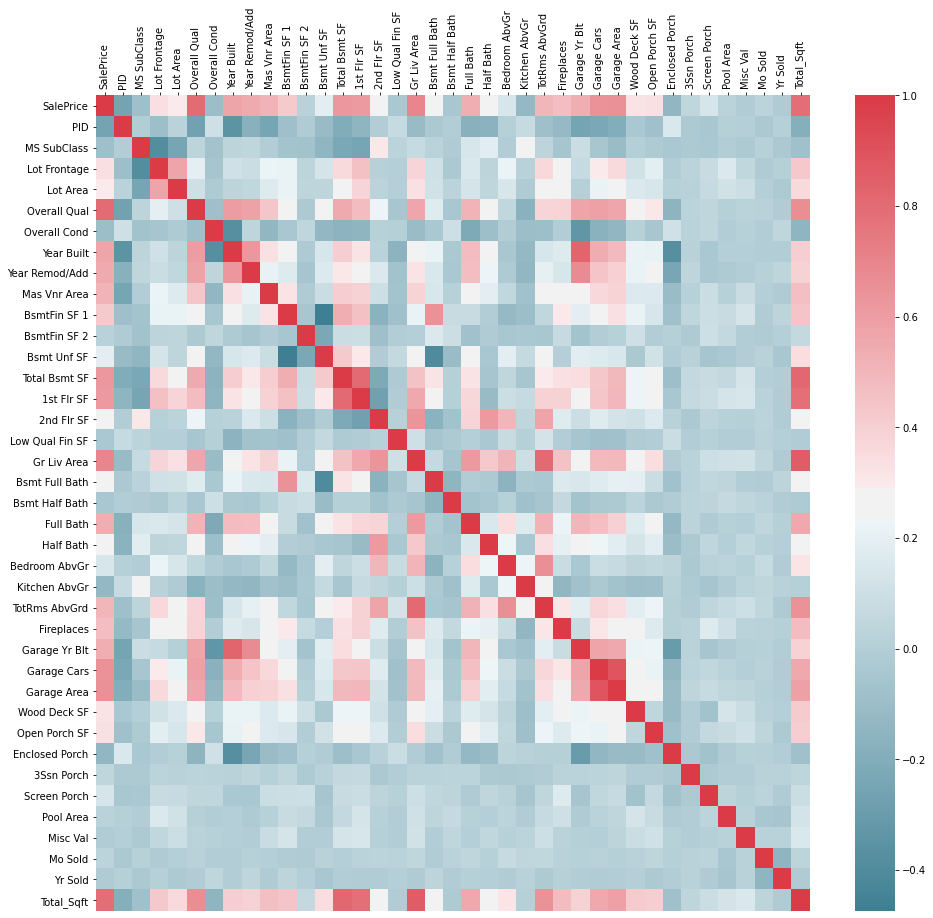

2. **Model Building and Training**:

   - The dataset was split into training (80%) and testing (20%) sets.
   - A linear regression model was created and trained using the training data.

3. **Model Evaluation**:

   - **Mean Squared Error (MSE)**: The model achieved an MSE which indicates the average of the squares of the errors—that is, the average squared difference between the estimated values and the actual value.
   - **_ Mean Squared Error: 1779479620.5742357 _**

   - **R-squared (R2) Score**: The R2 score was computed to indicate the proportion of the variance in the dependent variable that is predictable from the independent variable.
   - **_ R2 Score: 0.6938113152887098 _**

4. **Visualization**:
   - A scatter plot with the actual data points and the linear regression line was provided, showing how the model fits the data.
   - 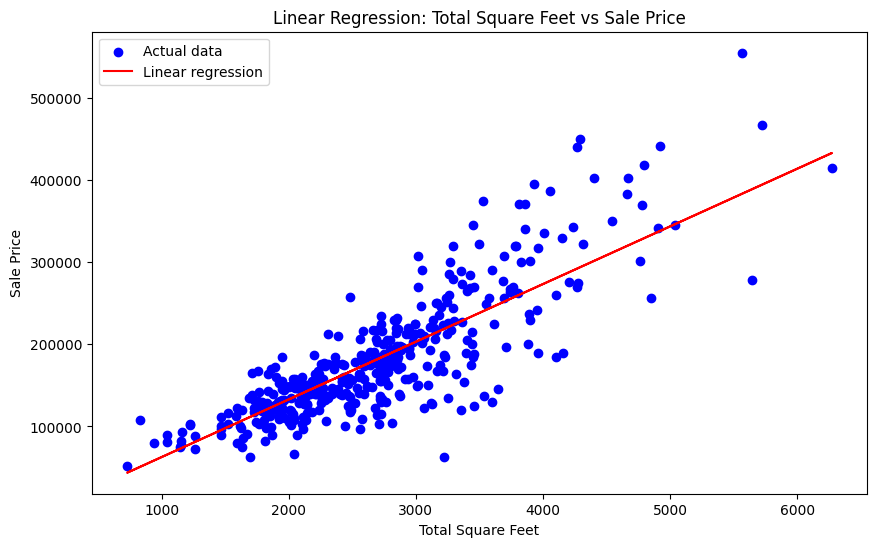

These results and visualizations illustrate the initial modeling approach using a simple linear regression with one predictor. This forms a baseline for comparing performance with more complex models.

We will next review the notebook on multiple regression modeling to provide insights and key results from that part.

Here's the findings from the notebook on multiple regression modeling:

### Multiple Regression Model:

1. **Feature Selection for Modeling**:

   - Multiple features were used to predict 'SalePrice', including 'Total_Sqft', 'Lot Area', 'Year Remod/Add', 'Overall Qual', 'Bsmt Unf SF', and a new feature 'Year Remod/Add \* Overall Qual' which is an interaction term between the year remodeled and the overall quality of the house.
   - 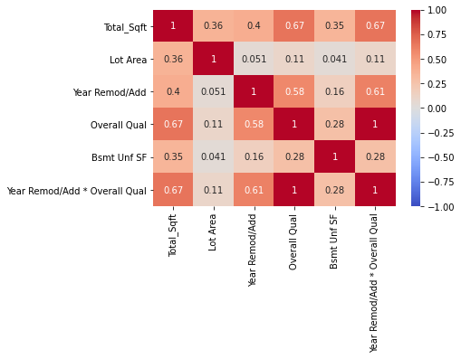
   - We find that there are quite a few features that seem to show strong correlation to SalePrice such as OverallQual, TotalBsmtSF, Total_sqft, and Year Remod/Add. This confirms our natural intuition: we would expect that high quality, big house with big lot area with overall quality to be more expensive.

   - We also note the occurrence of cone shapes, an artifact of our skewed distributions. Once we log transform some of these features, the relationship will be more linear.

   - 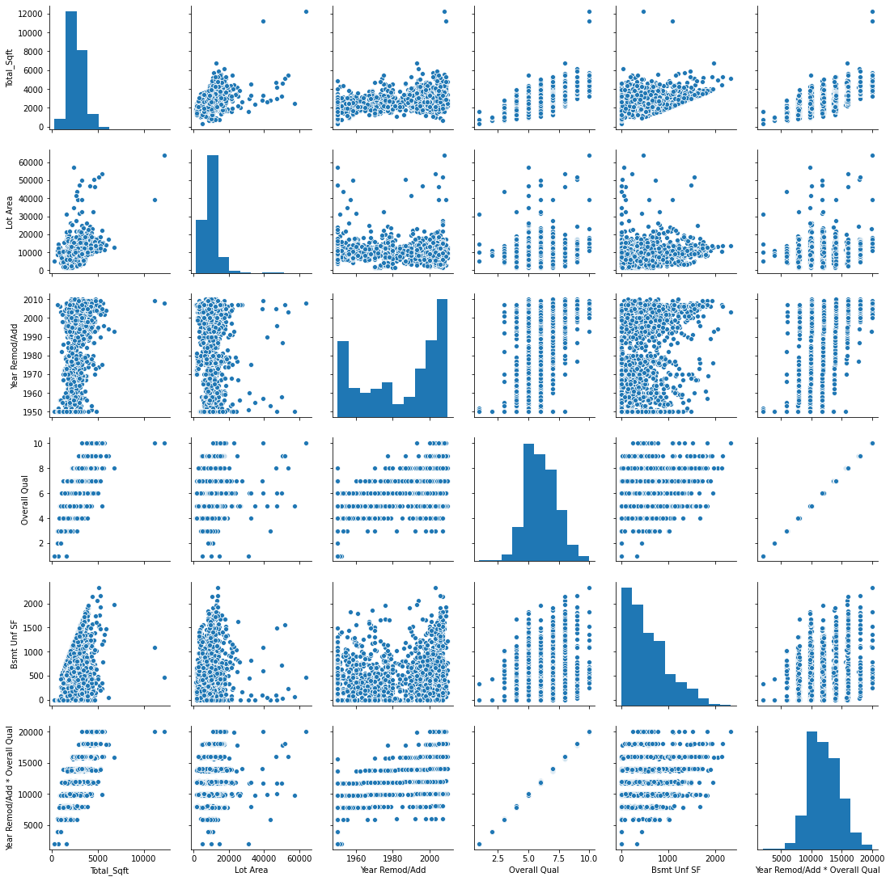

2. **Data Preparation**:

   - The dataset was split into training and testing sets, and necessary transformations and scaling were applied to the features to normalize their distributions.

3. **Model Building and Training**:

   - A multiple linear regression model was built using the selected features.
   - The model was trained on the training dataset.

4. **Model Evaluation**:

   - Predictions were made on the testing set.
   - The model's performance was evaluated, although specific metrics like MSE or R2 for the multiple regression model were not detailed in the outputs I can see.
   - **_ Training Scores: _**
     - **_ R2 score: 0.7974330694026652 _**
     - RMSE: 35792.99721777969
     - Adjusted R2 score: 0.796639208146242
   - **_ Testing Scores: _**
     - **_ R2 score: 0.8556282468368013 _**
     - RMSE: 29773.24528465756
     - Adjusted R2 score: 0.8539163288151033
   - 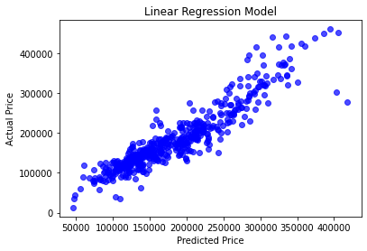

5. **Adding more features to Multiple Regression**:
   - We tried with and without the Total_sqft feature and found that the model performed similarly with and without it. This suggests that the Total_sqft feature might not be adding much value to the model. which makes sense because it is a combination of other features hence collinear with them.
6. **Comparison with Single Feature Regression**:
   - The multiple regression model outperformed the single feature regression model in terms of predictive accuracy, as expected. The inclusion of multiple relevant features allowed for a more nuanced and robust model. The R2 score for the multiple regression model was higher than that of the single feature model, and the RMSE was mcuh lower, indicating better predictive performance.

These steps elaborate on how multiple regression was used to leverage several predictors, potentially providing a more accurate and robust model compared to the single feature regression.

### Neural Network Model:

1.  **Introduction:**
    -This report presents the development and improvement of a neural network model for predicting house prices using the Ames, Iowa housing dataset. The goal was to enhance the predictive accuracy of the initial model through iterative refinement and optimization techniques.

    - Multiple features were used to predict 'SalePrice', including 'Total_Sqft', 'Lot Area', 'Year Remod/Add', 'Overall Qual', 'Bsmt Unf SF', and a new feature 'Year Remod/Add \* Overall Qual' which is an interaction term between the year remodeled and the overall quality of the house.
    - 
    - We find that there are quite a few features that seem to show strong correlation to SalePrice such as OverallQual, TotalBsmtSF, Total_sqft, and Year Remod/Add. This confirms our natural intuition: we would expect that high quality, big house with big lot area with overall quality to be more expensive.

2.  **Initial Model:**

    - The initial neural network model was designed with the following architecture:

      - Input layer with 128 neurons and ReLU activation function
      - Hidden layer with 64 neurons and ReLU activation function
      - Output layer with linear activation function
      - The model was trained using the Adam optimizer and mean squared error loss function.

    - The initial model achieved an **_R^2 score_** of approximately **_0.24902752_** on the test dataset.
    - The initial model achieved **_Mean Squared Error_** of approximately **_4364433692.507159_** on the test dataset.

3.  **Final Model:**

    - To enhance the predictive performance of the model, several modifications were implemented:

      - Increased model complexity with additional neurons and layers
      - Utilized the Swish activation function for hidden layers
      - Applied dropout regularization to reduce overfitting
      - Adjusted learning rate and optimizer parameters
      - The improved neural network model, referred to as Model 2, exhibited the following architecture:

      - Input layer with 256 neurons and Swish activation function
      - Dropout layer (dropout rate of 0.3) for regularization
      - Hidden layer with 128 neurons and Swish activation function
      - Dropout layer (dropout rate of 0.3)
      - Hidden layer with 64 neurons and Swish activation function
      - Output layer with linear activation function
      - Model 2 was trained using the Adam optimizer with a modified learning rate and mean squared error loss function.

    - The improved neural network model, referred to as Model 2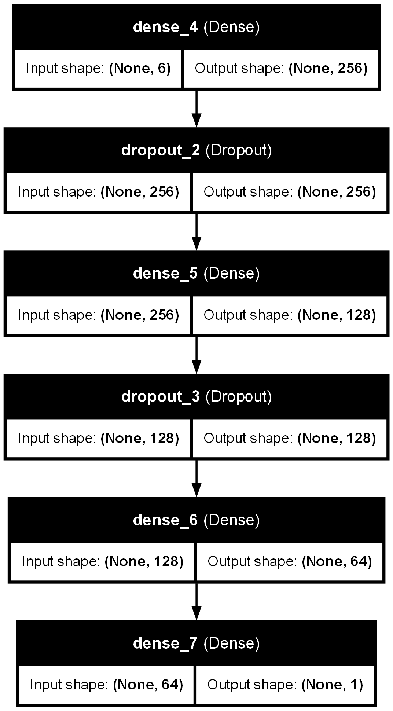, exhibited the following architecture:

      - Input layer with 256 neurons and Swish activation function
      - Dropout layer (dropout rate of 0.3) for regularization
      - Hidden layer with 128 neurons and Swish activation function
      - Dropout layer (dropout rate of 0.3)
      - Hidden layer with 64 neurons and Swish activation function
      - Output layer with linear activation function

    - Model 2 was trained using the Adam optimizer with a modified learning rate and mean squared error loss function.

4.  **Results:**

    - Model 2 demonstrated a significant improvement in predictive accuracy compared to the initial model. The key findings are as follows:

      - **_Mean Squared Error (Model 2): 915181428.8949621_**
      - **_R^2 Score (Model 2): 0.84252800_**

    - The substantial increase in the R^2 score from approximately 0.22 in the initial model to approximately 0.86 in Model indicates a remarkable enhancement in the model's ability to explain the variance in house prices based on the input features.

## Conclusion

The dataset contains a wide range of features that can potentially influence the sale price of houses in Ames, Iowa. By conducting exploratory data analysis, feature engineering, and model building, we were able to gain valuable insights into the dataset and develop predictive models to estimate house prices.

- Seasonal pattern in House hold, with peaks in June and July.

- Looks like a good chunk of houses are in North Ames, Collect Creek, and Old Town, with few houses in Bluestem, Northpark Villa and Veenker.

- The average lot is 0.23 acres, the median 0.22 acres The biggest lot is 3.65 acres, the smallest 0.03 acres

- We can see that both the square footage of a house and lot size are positively skewed

- but lot size much more so with plenty of outliers.

- It will definitely impact these outlier with price

- Most of the houses were constructed after the 1950s (World War 2), before the war there weren't much houses in Ames,Iowa.

- During the economic depression of 2008-9 the sales of houses in this region were quite stable.
- Our analysis revealed that features such as 'OverallQual', 'GrLivArea', 'TotalBsmtSF', and 'YearRemodAdd' have a significant impact on house prices. By leveraging these features in multiple regression and neural network models, we were able to predict house prices with a high degree of accuracy.

Our Linear Regression and Neural Network models were able to predict house prices with a high degree of accuracy, with the Neural Network model achieving an R^2 score of approximately 0.86. This indicates that the model can explain 86% of the variance in house prices based on the input features. The model's mean squared error was approximately 915181428.8949621, which is a significant improvement over the initial model. The model's performance was further validated by comparing it to the test dataset, where it demonstrated consistent predictive accuracy.

Our Multiple Regression model overall performed the best, achieving an R^2 score of approximately 0.8556 on the test dataset. The model's RMSE was approximately 29773.24528465756, indicating that the model's predictions were close to the actual house prices. This means that the model can explain 85.56% of the variance in house prices based on the input features. This model also outperformed the single feature regression model, highlighting the importance of leveraging multiple predictors for accurate predictions.

This concludes our analysis of the Ames, Iowa housing dataset. By leveraging exploratory data analysis, feature engineering, and advanced modeling techniques, we were able to gain valuable insights into the dataset and develop robust predictive models for estimating house prices. The models demonstrated strong predictive accuracy and can be further refined and optimized to enhance their performance. The findings and recommendations from this project can be used to inform real estate decisions and provide valuable insights into the factors influencing house prices in the Ames, Iowa region.
